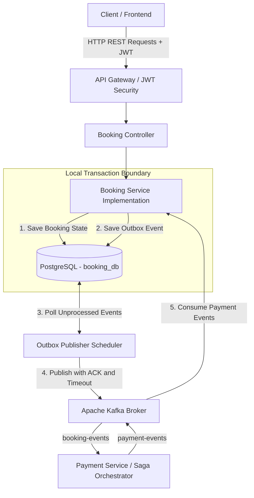

# Booking Service - Architecture & Technical Documentation

## 1. Overview

The **Booking Service** is a core microservice within the **Event Ticketing System**, responsible for managing ticket reservations, booking creation, booking status management, cancellation, and booking history.

The service follows a layered microservice architecture and communicates with other services through REST APIs and asynchronous Apache Kafka events.

It uses PostgreSQL for persistent storage and implements the **Transactional Outbox Pattern** to improve the reliability of event publishing.

The Booking Service integrates with the Event Service to validate event-related information and participates in payment workflows through Kafka-based event communication.

### Key Features

- Ticket booking and reservation management
- Booking creation and cancellation
- Booking status management
- Ticket availability validation
- User-specific booking history
- Administrative booking retrieval
- Idempotent booking creation
- Transactional Outbox Pattern
- Apache Kafka event publishing
- Payment event consumption
- RESTful API endpoints
- JWT-based authentication through the API Gateway
- Database schema versioning using Flyway
- Automated unit and integration testing
- Docker-based deployment

---

## 2. Responsibilities

The Booking Service is responsible for:

1. **Ticket Booking and Reservation**
    - Process booking requests.
    - Validate booking-related information.
    - Verify ticket availability through the Event Service.

2. **Booking Creation and Management**
    - Create new bookings.
    - Store booking information in PostgreSQL.
    - Prevent duplicate booking operations using idempotency keys.

3. **Booking Status Management**
    - Maintain booking states.
    - Process cancellation requests.
    - Update booking status according to payment-related events.

4. **Booking History Management**
    - Retrieve bookings for authenticated users.
    - Retrieve individual bookings using UUIDs.
    - Support paginated booking retrieval.

5. **Event-Driven Communication**
    - Generate booking-related events.
    - Persist events using the Transactional Outbox Pattern.
    - Publish events through Apache Kafka.
    - Consume payment-related events.

6. **Data Consistency**
    - Maintain transactional consistency between booking records and outbox events.
    - Handle invalid booking operations.
    - Enforce booking ownership rules.

---

## 3. Technology Stack

| Technology | Version / Details |
|---|---|
| Java | 21 |
| Spring Boot | 4.1.1 |
| Spring Web | Spring Boot Starter Web |
| Spring Data JPA | Spring Boot Starter Data JPA |
| Spring Validation | Spring Boot Starter Validation |
| Spring Kafka | Kafka Integration |
| Apache Kafka | Asynchronous Event Messaging |
| PostgreSQL | `booking_db` |
| Flyway | Database Schema Migrations |
| Spring Boot Actuator | Application Health Monitoring |
| JUnit 5 | Unit and Integration Testing |
| Mockito | Mocking Framework |
| MockMvc | REST Controller Testing |
| Lombok | Boilerplate Code Reduction |
| Maven | Build and Dependency Management |
| Docker | Application Containerization |
| Docker Compose | Local Infrastructure Orchestration |

### Main Dependencies

The primary dependencies include:

- `spring-boot-starter-web`
- `spring-boot-starter-data-jpa`
- `spring-boot-starter-validation`
- `spring-kafka`
- `postgresql`
- `lombok`
- `spring-boot-starter-test`

Additional dependencies required by the documented features include Flyway, Spring Boot Actuator, and the relevant test database driver.

---

## 4. System Architecture

The Booking Service follows a layered architecture with event-driven communication.

### Main Components

**API Gateway**

- Receives incoming HTTP requests.
- Handles JWT authentication.
- Routes booking requests to the Booking Service.

**Booking Controller**

- Exposes REST endpoints.
- Handles incoming booking requests.
- Validates request DTOs.
- Delegates business operations to the service layer.

**Booking Service Implementation**

- Executes booking business logic.
- Validates booking operations.
- Handles idempotency.
- Manages booking transactions.
- Creates transactional outbox records.

**PostgreSQL Database**

- Stores booking information.
- Stores transactional outbox events.
- Maintains database constraints and indexes.

**Outbox Publisher Scheduler**

- Retrieves unpublished outbox events.
- Publishes events to Apache Kafka.
- Handles publishing acknowledgements and retry behavior.

**Apache Kafka**

- Provides asynchronous event messaging.
- Enables communication between Booking Service and Payment Service.

**Payment Service**

- Consumes booking-related events.
- Processes payment workflows.
- Publishes payment-related events.

### 4.1 System Architecture & Data Flow



### 4.2 Booking Creation Flow

1. The client sends a booking request with a JWT.
2. The API Gateway authenticates the request.
3. The request is forwarded to the Booking Controller.
4. The Booking Controller validates the request.
5. The Booking Service validates event information and ticket availability.
6. The Booking Service checks the idempotency key.
7. The booking record is persisted in PostgreSQL.
8. A corresponding outbox event is persisted within the same database transaction.
9. The transaction commits.
10. The Outbox Publisher Scheduler retrieves pending events.
11. The scheduler publishes events to Apache Kafka.
12. The Payment Service consumes booking events.
13. The Payment Service processes the payment workflow.
14. Payment-related events are published to Kafka.
15. The Booking Service consumes payment events and updates the booking state.

---

## 5. Transactional Outbox Pattern

The Booking Service implements the **Transactional Outbox Pattern** to improve consistency between database operations and asynchronous event publishing.

### 5.1 Problem

Publishing a Kafka event directly during a database transaction can introduce consistency problems.

For example:

- A booking might be saved successfully while Kafka publishing fails.
- A Kafka event might be published while the database transaction subsequently rolls back.

These situations can cause inconsistent states across microservices.

### 5.2 Solution

The Transactional Outbox Pattern stores booking information and the corresponding integration event in the same database transaction.

The outbox publisher subsequently publishes the stored event to Kafka.

### 5.3 Processing Steps

1. Begin a database transaction.
2. Create or update the booking.
3. Create the corresponding outbox event.
4. Commit both records atomically.
5. Retrieve pending outbox events.
6. Publish events to Kafka.
7. Wait for the configured acknowledgement or timeout.
8. Mark successfully published events as processed.
9. Retry failed publishing operations.

### 5.4 Benefits

- Atomic database persistence
- Reduced risk of lost integration events
- Reliable asynchronous communication
- Retry support
- Improved resilience during Kafka outages
- Reduced coupling between database transactions and Kafka availability

### Important Consideration

The Transactional Outbox Pattern generally supports **at-least-once event delivery**.

Therefore, Kafka consumers should implement idempotent processing to prevent duplicate business operations.

---

## 6. API Endpoints & Security Matrix

| HTTP Method | Endpoint | Access Role | Description |
|---|---|---|---|
| `POST` | `/api/v1/bookings` | `USER`, `ADMIN` | Create a new ticket booking and generate an outbox event |
| `GET` | `/api/v1/bookings/my-bookings` | `USER`, `ADMIN` | Retrieve paginated bookings for the authenticated user |
| `GET` | `/api/v1/bookings/{id}` | `USER`, `ADMIN` | Fetch specific booking details by UUID |
| `GET` | `/api/v1/bookings` | `ADMIN` | Fetch all system bookings with pagination |
| `PATCH` | `/api/v1/bookings/{id}/cancel` | `USER`, `ADMIN` | Cancel a booking owned by the requesting user |
| `GET` | `/actuator/health` | `Public` | Service health check |

### 6.1 Security Considerations

- JWT authentication is handled by the API Gateway.
- Protected endpoints require authenticated requests.
- Administrative endpoints are restricted to the `ADMIN` role.
- Booking cancellation must enforce ownership validation.
- User-specific booking retrieval must prevent unauthorized data access.
- Booking identifiers use UUIDs.
- Internal identity headers must be supplied only by trusted infrastructure.
- Direct external access to trusted internal service endpoints should be restricted.

---

## 7. Database Architecture

The Booking Service uses PostgreSQL as its primary relational database.

**Database Name:** `booking_db`

### 7.1 Main Tables

#### Bookings Table

The `bookings` table stores ticket booking information.

It supports:

- Booking identification
- User ownership
- Event association
- Booking status management
- Idempotency tracking
- Booking history retrieval

#### Outbox Events Table

The `outbox_events` table stores integration events generated during booking transactions.

It supports:

- Event persistence
- Pending event retrieval
- Kafka event publishing
- Event processing tracking
- Failed publishing retries

### 7.2 Idempotency

Booking creation uses idempotency keys to prevent duplicate booking operations.

When a request is repeated using an existing idempotency key, the service should return the previously created booking rather than create a duplicate.

Database-level uniqueness constraints and appropriate transaction handling should enforce idempotency under concurrent requests.

---

## 8. Database Migrations - Flyway

Database schema management is handled using Flyway migration scripts.

### Migration Directory

```text
src/main/resources/db/migration/
```

### Initial Migration

```text
V1__create_bookings_and_outbox_tables.sql
```

This migration initializes:

- The `bookings` table
- Indexes on `user_id` and `idempotency_key`
- The `outbox_events` table

### Benefits of Flyway

- Version-controlled database schema
- Repeatable deployment processes
- Consistent database structures
- Automated migration execution
- Improved database change management

---

## 9. Testing Documentation

### 9.1 Testing Overview

The Booking Service includes automated unit tests and integration tests to validate booking creation, booking retrieval, cancellation, idempotency handling, database persistence, and error handling.

The testing strategy focuses on verifying business logic correctness, preventing duplicate booking operations, enforcing booking ownership rules, and validating interactions with the persistence layer.

The project uses Spring Boot Test, JUnit 5, Mockito, and Spring Data JPA.

#### Testing Objectives

- Verify successful booking creation and persistence.
- Validate booking idempotency to prevent duplicate operations.
- Verify booking cancellation and booking state transitions.
- Prevent unauthorized booking cancellations.
- Validate booking retrieval and pagination functionality.
- Verify appropriate exception handling for invalid operations.
- Validate transactional outbox event creation.
- Detect application configuration and dependency initialization issues.

### 9.2 Testing Technologies

| Technology | Purpose |
|---|---|
| Java 21 | Programming language |
| Spring Boot Test | Spring application context and integration testing |
| JUnit Jupiter | Test execution, assertions, and test organization |
| Mockito | Mocking external dependencies and verifying interactions |
| Spring Data JPA | Database persistence and repository operations |
| Maven Surefire Plugin | Automated test execution and reporting |
| PostgreSQL | Persistence layer used by the Booking Service |
| Spring Transaction Management | Transactional test isolation and rollback |

#### Important Testing Annotations

| Annotation | Description |
|---|---|
| `@SpringBootTest` | Loads the Spring Boot application context |
| `@ActiveProfiles("test")` | Activates the test-specific Spring profile |
| `@Transactional` | Runs tests within transactions normally rolled back after execution |
| `@MockitoBean` | Replaces a Spring-managed dependency with a Mockito mock |
| `@Test` | Identifies a test method |
| `@BeforeEach` | Executes setup logic before each test |
| `@DisplayName` | Provides readable test names |
| `@Nested` | Organizes related tests into logical groups |

### 9.3 Unit Testing

Unit tests validate the business logic of the Booking Service in isolation by mocking dependencies such as repositories, external service clients, and serialization components.

**Primary Test Class:** `BookingServiceImplTest.java`

#### 9.3.1 Booking Creation Tests

Booking creation tests verify that the service processes booking requests correctly and handles exceptional conditions.

**Tested Scenarios:**

- Successful booking creation
- Duplicate idempotency handling
- Booking event serialization failures
- Verification of booking persistence interactions
- Verification of transactional outbox event creation

A successful booking operation is expected to create the appropriate booking data and corresponding transactional outbox event.

When a request contains an existing idempotency key, the service should return the existing booking rather than create a duplicate.

Serialization failure tests intentionally simulate an exception while preparing the booking event payload.

**Execution Result:**

```text
Tests Run: 5
Passed: 5
Failed: 0
```

#### 9.3.2 Booking Cancellation Tests

Cancellation unit tests verify business rules related to booking ownership and valid state transitions.

The tests cover cancellation operations under different booking conditions, including successful cancellation and rejected cancellation attempts.

**Execution Result:**

```text
Tests Run: 5
Passed: 5
Failed: 0
```

#### 9.3.3 Retrieve Bookings by User ID

These tests validate the service logic responsible for retrieving bookings associated with a particular user.

The testing focuses on user-specific booking retrieval and the expected service response.

**Execution Result:**

```text
Tests Run: 4
Passed: 4
Failed: 0
```

#### 9.3.4 Retrieve All Bookings

These tests verify the service functionality responsible for retrieving booking records.

**Execution Result:**

```text
Tests Run: 4
Passed: 4
Failed: 0
```

#### 9.3.5 Unit Test Summary

| Test Group | Tests | Result |
|---|---:|---|
| Create Booking Tests | 5 | Passed |
| Cancel Booking Tests | 5 | Passed |
| Get Bookings By User ID Tests | 4 | Passed |
| Get All Bookings Tests | 4 | Passed |
| Other Unit Test Groups | Not individually detailed | See test reports |

The full Maven test execution reported 49 tests in total, with zero assertion failures and one application context initialization error.

### 9.4 Integration Testing

Integration tests validate the interaction between the Booking Service business logic and the database persistence layer.

Unlike isolated unit tests, these tests use the Spring Boot application context and real Spring Data repository operations.

The `EventResolver` dependency is mocked to avoid making actual requests to the external Event Service.

Integration tests are executed using the `test` Spring profile.

#### 9.4.1 CreateBookingIntegrationTest

**Test Class:** `CreateBookingIntegrationTest.java`

This integration test suite validates booking creation, persistence, and idempotency behavior.

**Test Case 1: Booking Persistence**

- Create a booking using valid booking information.
- Verify that the booking is persisted.
- Verify the booking status and booking information.

**Test Case 2: Transactional Outbox Persistence**

- Create a valid booking.
- Verify that the booking is persisted.
- Verify that the corresponding outbox event is created.

**Test Case 3: Duplicate Idempotency Key**

- Create a booking using an idempotency key.
- Repeat the request using the same key.
- Verify that duplicate booking records are not created.

**Test Case 4: Different Idempotency Keys**

- Create booking requests using different idempotency keys.
- Verify that separate bookings can be created.

**Verified Execution Result:**

```text
Tests run: 4, Failures: 0, Errors: 0, Skipped: 0

BUILD SUCCESS
```

#### 9.4.2 CancelBookingIntegrationTest

**Test Class:** `CancelBookingIntegrationTest.java`

This integration test suite validates booking cancellation and authorization rules.

**Test Case 1: Successful Booking Cancellation**

- Create a booking using a valid event and user ID.
- Cancel the booking using the booking owner's ID.
- Verify that the service returns `CANCELLED`.
- Retrieve the booking from the database.
- Verify that the persisted booking status is `CANCELLED`.

**Test Case 2: Unauthorized Cancellation**

- Create a booking for an authorized user.
- Attempt cancellation using another user's ID.
- Verify that `UnauthorizedAccessException` is thrown.
- Verify that the booking remains in `PENDING_PAYMENT` status.

**Test Case 3: Duplicate Cancellation**

- Create a booking.
- Successfully cancel the booking.
- Attempt to cancel the same booking again.
- Verify that `InvalidBookingStateException` is thrown.
- Verify that the booking remains `CANCELLED`.

**Verified Execution Result:**

```text
Tests run: 3, Failures: 0, Errors: 0, Skipped: 0

BUILD SUCCESS
```

#### 9.4.3 GetBookingIntegrationTest

**Test Class:** `GetBookingIntegrationTest.java`

This integration test suite validates booking retrieval functionality.

**Test Case 1: Retrieve Booking by ID**

- Create a booking.
- Retrieve the booking using its UUID.
- Verify that the returned booking is not null.
- Verify that the booking ID matches.
- Verify that the idempotency key matches.

**Test Case 2: Booking Not Found**

- Generate a UUID that does not correspond to an existing booking.
- Attempt to retrieve the booking.
- Verify that `ResourceNotFoundException` is thrown.

**Test Case 3: Retrieve User Bookings**

- Create a booking for a particular user.
- Retrieve bookings using the user's UUID.
- Verify that the response is not null.
- Verify that the result contains at least one booking.

The original implementation contains three tests.

An enhanced version was also proposed to verify user data isolation and empty results, but its execution has not been confirmed.

**Execution Status:** Not separately verified from the available test output.

### 9.5 Integration Test Summary

| Test Suite | Test Cases | Execution Status |
|---|---:|---|
| CreateBookingIntegrationTest | 4 | Passed |
| CancelBookingIntegrationTest | 3 | Passed |
| GetBookingIntegrationTest (Original) | 3 | Execution not separately confirmed |

**Confirmed Integration Test Results:**

```text
Total Confirmed Tests: 7
Passed: 7
Failed: 0
Errors: 0
```

The integration tests provide confidence in booking creation, cancellation, database persistence, and idempotency under the tested conditions.

### 9.6 Test Configuration

Integration tests use a dedicated Spring profile:

```java
@ActiveProfiles("test")
```

Test-specific configuration can be maintained in:

```text
src/test/resources/application-test.yml
```

This configuration should provide the properties required to initialize the application context, including database, Kafka, and Redis settings where applicable.

Environment variables referenced by application configuration must be available during execution or have suitable test-specific values.

Sensitive credentials must not be committed to the repository.

#### Mocking External Dependencies

The integration tests replace the Event Service resolver with a Mockito mock:

```java
@MockitoBean
private EventResolver eventResolver;
```

**Example Mocked Event Response:**

```java
EventResponseDto mockEventResponse =
        EventResponseDto.builder()
                .id(eventId)
                .ticketPrice(new BigDecimal("1500.00"))
                .availableTickets(30)
                .build();

when(eventResolver.getValidatedEvent(eventId, 2))
        .thenReturn(mockEventResponse);
```

This allows booking integration tests to execute without depending on a running Event Service.

#### Transactional Test Isolation

The integration tests use:

```java
@Transactional
```

Spring normally rolls back the test-managed transaction after each test, reducing the risk of persistent test data affecting subsequent test executions.

However, rollback-based integration tests do not independently verify the behavior of transactions after an actual database commit.

### 9.7 Running the Tests

All commands should be executed from the Booking Service project root directory.

#### Run All Tests

```bash
./mvnw clean test
```

#### Run Booking Creation Integration Tests

```bash
./mvnw clean test -Dtest=CreateBookingIntegrationTest
```

#### Run Booking Cancellation Integration Tests

```bash
./mvnw clean test -Dtest=CancelBookingIntegrationTest
```

#### Run Booking Retrieval Integration Tests

```bash
./mvnw clean test -Dtest=GetBookingIntegrationTest
```

#### Run Booking Service Unit Tests

```bash
./mvnw clean test -Dtest=BookingServiceImplTest
```

#### Run Selected Integration Test Classes

```bash
./mvnw clean test -Dtest=CreateBookingIntegrationTest,CancelBookingIntegrationTest,GetBookingIntegrationTest
```

#### Run Application Context Test

```bash
./mvnw test -Dtest=BookingserviceApplicationTests
```

#### Locate Test Reports

Maven Surefire generates test reports in:

```text
target/surefire-reports/
```

The generated reports contain test execution details, failures, errors, and stack traces.

### 9.8 Test Execution Results

#### Confirmed Successful Executions

| Test Suite | Passed | Failed | Errors | Build |
|---|---:|---:|---:|---|
| CreateBookingIntegrationTest | 4 | 0 | 0 | SUCCESS |
| CancelBookingIntegrationTest | 3 | 0 | 0 | SUCCESS |

#### Full Maven Test Suite

A separate full test execution produced the following results:

```text
Tests run: 49
Failures: 0
Errors: 1
Skipped: 0

BUILD FAILURE
```

The reported error occurred in:

```text
BookingserviceApplicationTests.contextLoads
```

The Spring Boot application context could not be initialized for this test.

The available output showed that no explicit test profile was active for that test.

The underlying configuration failure was not fully identified from the provided log.

The other 48 tests completed without reported failures or errors.

This application context issue must be resolved before the full test suite can be considered successful.

### 9.9 Testing Best Practices

The Booking Service testing approach incorporates several important software testing practices.

**Separation of Unit and Integration Tests**

Unit tests validate isolated business logic, while integration tests validate service and database interactions.

**Mocking External Services**

The Event Service resolver is mocked so integration tests remain independent of external service availability.

**Transactional Test Isolation**

Database modifications are rolled back after transactional tests to minimize interference between test cases.

**Negative Testing**

Exception scenarios such as unauthorized cancellation, duplicate cancellation, missing bookings, and serialization failures are included.

**Idempotency Verification**

Repeated booking requests are tested to help prevent duplicate booking creation.

**Database State Verification**

Integration tests verify persisted booking status rather than relying exclusively on service response values.

**Readable Test Naming**

Descriptive test methods and display names document the expected behavior of each test case.

### 9.10 Recommended Additional Tests

To improve production readiness, the following test scenarios should be considered:

1. **Concurrent Booking Requests:** Verify that simultaneous requests using the same idempotency key cannot create duplicate bookings.

2. **Transaction Rollback:** Verify that booking creation is rolled back if outbox persistence fails.

3. **Database Constraints:** Verify that duplicate idempotency keys are rejected at the database level when appropriate.

4. **Outbox Event Cancellation:** Verify cancellation-related outbox persistence if cancellation is designed to produce an event.

5. **Pagination Boundaries:** Test empty results, invalid pagination parameters, and multiple result pages.

6. **User Data Isolation:** Verify that user-specific retrieval never includes bookings belonging to another user.

7. **Application Context Initialization:** Ensure the application context test passes with a properly configured test environment.

8. **Security Integration:** Verify that the API layer enforces authorization for booking retrieval and cancellation.

### 9.11 Testing Conclusion

The Booking Service has demonstrated successful automated integration test execution for booking creation, cancellation, database persistence, and idempotency.

The confirmed integration test executions completed with **7 passed tests, zero failures, and zero errors**.

The broader Maven test execution reported **48 successful tests and one application context initialization error**.

Consequently, the complete test suite has not yet achieved a successful build.

The current testing approach establishes a foundation for maintaining booking correctness, reliability, and authorization behavior.

Additional concurrency, transaction-commit, security, and failure-recovery tests are recommended to strengthen confidence in production deployment.

---

## 10. Local Deployment & Docker Setup

### 10.1 Prerequisites

Ensure the following tools are installed:

- JDK 21
- Apache Maven
- Docker Engine or Docker Desktop
- Docker Compose

### 10.2 Running via Docker Compose

**Step 1: Build the Application JAR**

```bash
mvn clean package -DskipTests
```

**Step 2: Start Infrastructure**

Start PostgreSQL, Kafka, and the Booking Service:

```bash
docker compose up --build -d
```

**Step 3: Verify Running Containers**

```bash
docker compose ps
```

**Step 4: Check Booking Service Logs**

```bash
docker logs -f booking-service
```

**Step 5: Check Application Health**

If Spring Boot Actuator is configured and exposed:

```bash
curl http://localhost:8082/actuator/health
```

Replace port `8082` with the actual exposed Booking Service port if different.

### 10.3 Stop Containers

```bash
docker compose down
```

### 10.4 Rebuild After Changes

```bash
mvn clean package -DskipTests

docker compose up --build -d
```

---

## 11. Reliability & Fault Tolerance

The Booking Service incorporates several reliability mechanisms.

### Database Transactions

Database transactions maintain consistency between booking state and outbox event persistence.

### Idempotency

Idempotency keys help prevent unintended duplicate booking creation.

### Transactional Outbox

Outbox event persistence supports eventual event delivery after successful database commits.

### Kafka Messaging

Apache Kafka enables asynchronous communication between Booking Service and Payment Service.

### Retry Handling

Failed event publishing attempts can be retried according to the publisher implementation.

### Event Consumer Idempotency

Kafka consumers should handle duplicate events safely.

### Health Monitoring

Spring Boot Actuator provides application health information when configured.

---

## 12. Future Improvements

Potential improvements include:

- PostgreSQL integration testing using Testcontainers
- Dead Letter Topics for failed Kafka messages
- Distributed tracing using OpenTelemetry
- Metrics collection using Micrometer and Prometheus
- Grafana monitoring dashboards
- Structured logging with correlation IDs
- Improved outbox publisher concurrency and locking
- Automated CI/CD pipelines
- Load and performance testing
- Additional concurrency testing
- Transaction rollback verification
- Security integration testing

---

## 13. Conclusion

The Booking Service provides ticket booking and reservation management capabilities within the Event Ticketing System.

Its layered architecture, PostgreSQL persistence, RESTful APIs, Kafka integration, and Transactional Outbox Pattern establish a foundation for reliable, scalable, and maintainable booking operations.

The automated testing approach validates important booking scenarios, including booking creation, cancellation, persistence, and idempotency.

Docker-based deployment and database migration management support consistent development and deployment workflows.

The architecture is designed to support future enhancements in observability, fault tolerance, scalability, and automated testing.