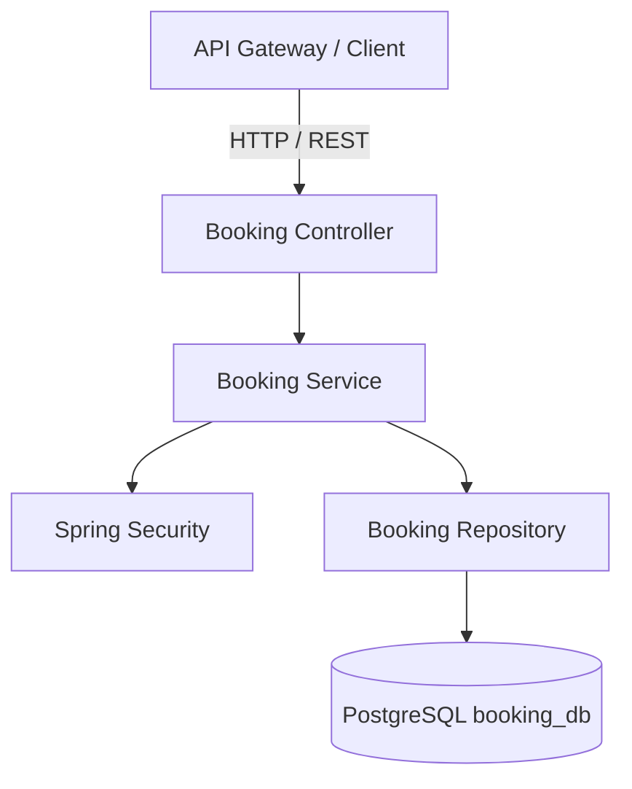

# Event Ticketing - Booking Service

## 📌 Overview

`event-ticketing-booking-service` is the core microservice responsible for managing the Booking and Reservation context of the Event Ticketing System.

## 🏗️ Service Responsibilities

* Ticket booking and reservation.
* Booking creation and management.
* Ticket availability validation.
* Booking status management.
* Booking history management.

## 🛠️ Tech Stack

* **Language:** Java 21
* **Framework:** Spring Boot 3.x
* **Security:** Spring Security
* **Database:** PostgreSQL (`booking_db`)
* **Containerization:** Docker

## 📐 Architecture

